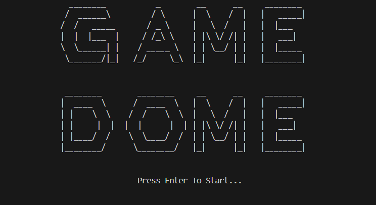

# Game Dome

This repository contains the source code for my Object-Oriented Programming (OOP) project, *"Game Dome."*


## Description

The "Game Dome" project is a game launcher that includes four different games, showcasing my understanding and application of OOP principles. The games included are:

- *Gerangelo*: A word unscrambling game.
- *Rock, Paper, Scissors*: The classic game of chance.
- *7 Up 7 Down*: A dice game based on predicting the sum.
- *SOS*: A strategic word game.

## Game Descriptions

### Gerangelo

The player selects a difficulty level: easy, medium, or hard. A set of scrambled letters is shown, and the player's goal is to rearrange the letters to form valid words.


### SOS

The goal of SOS is to spell out the word "SOS" within the connected boxes on the board. The sequence must be vertical, horizontal, or diagonal. Players take turns placing a letter (either S or O) on the board. Letters can be placed anywhere, without needing to connect to pre-existing letters. To score a point, a player must complete the sequence "SOS".


### Rock, Paper, Scissors

The player selects one of three options: Rock, Paper, or Scissors. The computer also selects one option randomly. The rules are simple:
- Rock beats Scissors.
- Scissors beat Paper.
- Paper beats Rock.

If the player's choice beats the computer's choice, the player wins.


### 7 Up 7 Down

Players place their bets on one or more of the following options:
- *7 Down*: The sum of the dice will be less than 7.
- *7 Up*: The sum of the dice will be 7 or greater.

The dice are rolled, and the results are revealed. If a player's guess matches the outcome, they win.


## Getting Started

To get started with any of these games, follow the instructions below:

1. *Clone the repository:*
    ```sh
    git clone https://github.com/yourusername/gamedome.git
    ```

2. *Navigate to the game directory:*
    ```sh
    cd gamedome
    ```

3. *Compile and run the game of your choice:*
    - For *Gerangelo*:
        ```sh
        g++ -o gerangelo gerangelo.cpp
        ./gerangelo
        ```
    - For *Rock, Paper, Scissors*:
        ```sh
        g++ -o rps rps.cpp
        ./rps
        ```
    - For *7 Up 7 Down*:
        ```sh
        g++ -o 7up7down 7up7down.cpp
        ./7up7down
        ```
    - For *SOS*:
        ```sh
        g++ -o sos sos.cpp
        ./sos
        ```

## Contributing

Feel free to fork this repository, make changes, and submit pull requests. For major changes, please open an issue first to discuss what you would like to change.

## License

This project is licensed under the MIT License. See the [LICENSE](LICENSE) file for details.

## Contact

If you have any questions or suggestions, feel free to open an issue or contact me at safiullah.aamir@gmail.com.
